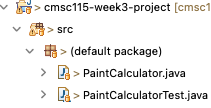
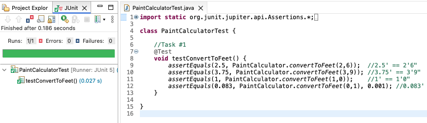

# Week 3 Project - Static Methods

## Learning Goals

....

## Introduction

In this project you will create methods to calculate the cost of painting a rectangular room.

## Project files


Expand `src` folder in the project explorer.  There are two classes `PaintCalculator.java` and `PaintCalculatorTest.java`.

Recall the two ways to run the `main()` method:
 
1. Right-click on `PaintCalculator.java`, then select `run as/java application`  

2. Open `PaintCalculator.java` in the editor, then click the green run button.  

### Task #1




Double-click on `PaintCalculator.java` to view the code in the editor.
The  `main()` method makes several calls to the `convertToFeet()` method. The `convertToFeet()` method should convert a quantity given in feet and inches to the equivalent amount of feet.  For example: 2 feet 6 inches should result in 2.5 feet.  There is an error in `convertToFeet()` that prevents the method from calculating the correct result due to integer division, i.e. `int/int ==> int`.  

The table below shows the expected output `main()` along with the actual output.
Run the program  to confirm the presence of an error.

|Expected Output|Actual Output|
|---|---|
|2.5|2.0|
|3.75|3.0|
|1.0|1.0|
|0.83333..|0.0|


- Update `convertToFeet()` to correct the integer division error. The method should convert inches to feet as a double. 
- Run `PaintCalculator` to confirm the correct output is produced.

```text
2.5
3.75
1.0
0.08333333333333333
```

- Test the task by running the `PaintCalculatorTest` Junit class.   Confirm the test passes:




## Deliverables

...

## Conclusion

...

## Resources

- [Python Tutor](http://pythontutor.com)

